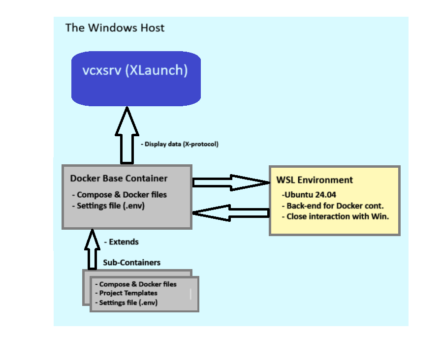

---
layout: default_c
RefPages:
 - howto_create_a_dev_container   
--- 

<small>
  
_This file is part of: **App-X11-Forward-Win32-C Development Template Stack**_
_Copyright (c) 2024. Nico Jan Eelhart._
_This source code is licensed under the MIT License found in the  'LICENSE.md' file in the root directory of this source tree._
</small>
  

**Quick links**{: style="color: #474747;font-size:12px; "} *(Reference to most common page sections)*{: style="color: #474747;font-size:11px; "}
- ***Basics***
  - [Install the WSL](#212-install-the-ubuntu-wsl-version)
  - [Configure the WSL](#213-configure-the-ubuntu-wsl-version) 
  - [Install the X-Server(client)](#214-install-the-x-server-vcxsrv)  
  - [Create the base container](#215-create-the-basic-docker-container)  
- ***Sub Containers***
  - [Create win32 C application container](#31steps-to-create-a-win32-C-application-container)  
  - [Start to win32 C application container](#321-attach-to-the-win32-c-application-container)  
  - [Develop with VSC](#4-develop-with-vsc-in-the-host)   

 
# 1 What 
In short, this is a Linux Docker cross-compiler image for programs written in the language C. It includes development possibilities for Windows Win32 applications, but it is not limited to them  
This Docker Linux (Ubuntu 24.04) container is designed for use on a Windows Docker (Desktop) host. Its purpose is to enable the development of **Win32 GUI applications** (C/C++, Rust)  within a Linux Docker container and display the running application on a Windows host. Because Docker is headless (no GUI support is available), we need a method to display the GUI application output (while debugging or running the application in release mode) on the Windows host system. Fortunately, this can be accomplished by combining the Docker Desktop container with a **WSL2** environment and the **vcxsrv** server (XLaunch).

*Important*{: style="color: orange;font-size:13px; "} <small>This container is specifically  for **Win32 development**. See also our ***APP-X11-Forward-Development-Template-Stack*** which is intended for .NET development and general purpose tasks. While both could be combined, I have chosen this separation to minimize complexity and ease maintenance.</small>  

This container stack consists of several different containers, each created based on a Dockerfile and Compose file. There is one **generic container** from which the other containers extend; this is referred to as the **Base Container**. It provides the aforementioned **win 32** environment and build tools, but does not include any GUI frameworks\Win32 projects.

The other containers are referred to as sub-containers. These containers require the Base Container, and each adds a specific Win32 development projects that run on the WSL and Docker container, See paragraph 3 for the currently supported sub-containers.

### 1.1 Architecture of the Containers
To help you understand the Container setup better, below is an image that shows how the components interact after the setup is completed. In this example, we assume the Win32 project is the Sub Container. We install the necessary components on the Windows Host (light blue square). In addition to the processes displayed in the image, this setup also includes fixed folders and  data files, which are detailed in the table *Data locations* below

### The Base Container

The Windows Host contains a **vcxsrv server** ([download](https://sourceforge.net/projects/vcxsrv/)) process which handles the X-Protocol data sent from the **docker Base Container**. It uses the **WSL environment** as a back-end to prepare the data.

The Docker Base container (grey square) contains an Ubuntu image, with the Docker files to create itself and a Docker environment settings file called '.env'

The **WSL environment** (yellow square) acts as the back-end for the Docker container. Although WSL2 uses a lightweight virtual machine, it is specifically designed to run Linux distributions natively on Windows, providing efficient and direct access to Windows resources. The WSL environment handles graphical output from the Docker container, which is then sent to the **vcxsrv (XLaunch)** server on the host. To use WSL2, Docker needs to be configured accordingly; this will be described later in this document.

The sub-containers consist of different self-contained containers that handle specific tasks\projects. For example specific win32 projects. This extends the Base Container with projects for the **Win32  runtime** and all required libraries. It manages the development and, includes:  building, debugging, and running Win32 applications using Visual Studio Code (VSC).

 ***Data Locations, Within root 'APP-X11-Forward-Win32-Template-Stack\'***

| **Folder**                                                                             | **Purpose**                                                             |
|:--------------------------------                                                       |:------------------------------------------------------------------------|
| <small>***./***</small>    	 				                             			                 | <small>***APP-X11-Forward-Win32-Development-Template-Stack***. The root folder |
| <small>***./Howto's***</small>   				 	                          			             | <small>Documentation</small> 											                                     |  
| <small>***./Base-Container***</small>    					                                     | <small>Root folder for the Base Containers</small>                                     |
| <small>***./Base-Container/Afx-Base-Win32-Service***</small>                            |<small>The Base Win32 Container .The docker and compose files</small>        |
| <small>***./Base-Container/Afx-Base-Win32-Service/wsl2distro***</small>                 |<small>The WSL Win32 environment after installation (.vhdx file) </small> |
| <small>***./Sub Container***</small>   					                                        |<small>Root folder for the Sub Containers</small>                                      |
| <small>***./Sub-Containers/Afx-X11-Forward-win32-c-Service***</small>                   |<small>Sub Container with Win32 GUI C desktop program</small>        |
| <small>***./Sub-Containers/Afx-X11-Forward-win32-c-Service/.vscode*** </small>          |<small>The settings of VSC when you open a container with VSC</small> |
| <small>***./Sub-Containers/Afx-X11-Forward-win32-c-Service/Project-Template***</small>  |<small>Template used by Sub Container to create the desktop app</small>            |
| <small>***./Sub-Containers/Afx-X11-Forward-win32-c-Service/.env***</small>              |<small>Settings use by the Docker Compose and Dockerfile </small>                      |
| <small>***./Sub-Containers/Afx-X11-Forward-win32-cpp-Service***</small>                 |<small>Sub Container with Win32 GUI C++ desktop program (***todo***)</small>        |

 

  
 

  
 **Side note**: Security Considerations and Network Configuration
 
 	<!-- On same line is failure, Don't indent the following Markdown lines!  -->
  
>### Security Considerations and Network Configuration  
>For personal use on a developer's PC or laptop, security risks are generally lower than in a production environment. However, it's still a good idea to follow some basic security practices. When running an X server (like vcxsrv) on your Windows host, configure vcxsrv to only accept connections from the local machine. This minimizes exposure and ensures that only applications on your PC can access the server. Additionally, keep your firewall enabled and set to block unsolicited incoming connections. While this setup is for development purposes and may not require strict security measures, these simple steps can help protect your system against unexpected threats, especially when connected to less secure networks.
 
In practice, this means that as a developer, you should leave the XLaunch **'Extra option' -> Disable access control** ***unchecked***

# 2. Create the Base Container
This chapter will cover the setup of the **Base Container Service** (folder: 'Base-Container') and everything else required to run a GUI application on a Windows host. At the end of this setup, we will demonstrate that the program works as expected by executing a sample X application in the Base Container (**xeyes**).

## 2.1 The Basic Container Setup
Before executing the Docker Compose file, ensure that the following items are installed and configured (refer to section 1.1, Process Architecture). The steps for these items will be explained in more detail in the following paragraphs:

  <small>**Overview**</small>
- **Download the  WSL version of Ubuntu**: Obtain the special version of Ubuntu for WSL   ([Download)](https://learn.microsoft.com/en-us/windows/wsl/install-manual). Scroll to the bottom of the page for manual versions.
- **Install WSL2**: Set up a dedicated WSL2 environment to serve as the backend for the Docker container.
- **Configure the WSL Ubuntu Distribution**: Ensure that the WSL Ubuntu distribution is properly configured.
- **Install and Configure an X-Server**: Install an X-server on the Windows host; we use VcXsrv  ([Download](https://sourceforge.net/projects/vcxsrv/)) for this purpose.
- **Run Docker to Create the Basic Image**: Execute the Docker files to create the basic container image.
- **Verify the Setup**: Display the result to demonstrate that everything works correctly.

### 2.1.1 Download the Special Ubuntu WSL version
Finding this version can be a bit challenging, especially because we need the manual installation files (with the .Appx or .AppxBundle extensions). The Windows Store provides a direct installer, but we cannot use it because we need to control the installation name and location. Follow these steps:
- ([Download](https://learn.microsoft.com/en-us/windows/wsl/install-manual)) the image from here, Scroll to almost the bottom where it states **'Downloading distributions'** and choose the *Ubuntu 24.04* link (note that this is the distribution  we support, you may try other ones and be fine with it, but we have not tested it)
- Now, as of Aug 2024, a lott of documentation\samples will state that your receive **\*.Appx** extension file and that you need to change the file to **\*.zip.**  But in our case you probably receive a **\*.AppxBundle** file which contains multiple Ubuntu versions. Below is shown how we get access to the right folder so we can install it in the next paragraph (in my case the download name is ***'Ubuntu2204-221101.AppxBundle'*** we use this name in our example:

  - First rename ***'Ubuntu2204-221101.AppxBundle'***' to ***'Ubuntu2204-221101.zip'***
  - Unpack the file with for example **7zip**
  - In the unpacked folder locate the file for your machine distribution ,likely ***'Ubuntu_2204.1.7.0_x64.appx'** rename this file to *.zip
  - Unpack the above renamed zip file
  - In the resulting folder you should see a file called ***'install.tar.gz'*** this is the location where the next command has to point to.

### 2.1.2 Install the Ubuntu WSL version
When we have the distribution source, we can install the WSL environment. To keep the Base Container files in one place we do this in the root of our Base-Service folder ( **'./Base-Container/Afx-BaseWin32-Service/wsl2distro'***).
- **Open** in the sub folder: ***'.\Base-Container\Afx-Base-Win32-Service\'*** a CMD prompt.
- **Execute** this command and replace the ***"install.tar.gz.file"*** with the result from the previous step(full path)
<pre class="nje-cmd-one-line"> wsl --import Ubuntu-docker-App-X11-Win32Dev ./wsl2-distro  "install.tar.gz" </pre>
This results in a **Ubuntu-docker-App-X11-Win32Dev** WSL in: **./wsl2-distro**. **Check**:
<pre class="nje-cmd-multi-line">

wsl --list --verbose    # Displays the distribution name, state, and there version
wsl --unregister YourDistributionName       # Remove the distribution
                                            # More WSL command in the next paragraph
</pre>

### 2.1.3 Configure the Ubuntu WSL version
To start and manage your WSL2 Ubuntu distribution, use the following command:
<pre class="nje-cmd-multi-line">

wsl -d Ubuntu-docker-App-X11-Win32Dev     #  This will open a CLI terminal and start the WSL if needed
                                          #  Use 'exit' to return to Windows. while it remains started
wsl --list --verbose                      #  Optional. Check if it is running (in other Windows CMD)
wsl --terminate Ubuntu-docker-App-X11-Win32Dev    #  Stops the distribution
wsl -d Ubuntu-docker-App-X11-Win32Dev -- ls /home #  Start, exec command, and returns direct(no CMD)
wsl --set-default Ubuntu-docker-App-X11-Win32Dev  #  Set default when running command; wsl

</pre>
Next we need to update and configure our distribution. Make sure our WSL distribution is started, and the execute the following Linux commands:
<pre class="nje-cmd-multi-line">

# 1.1                                   # Update the Ubuntu distribution
apt update && apt upgrade -y            

# 1.2.                                  # Make sure docker is installed in the WSL                    
apt update && apt install docker.io -y  # to be able to attach to a container in the Host 

# 2.1 The next command will update our DISPLAY environment variable
export DISPLAY=$(grep -oP "(?<=nameserver ).+" /etc/resolv.conf):0

# 2.2.                                  # Display the variable (check)
echo $DISPLAY                          

# 3.1 Make sure the Docker daemon is start at start up
echo -e "\n# Start Docker daemon if not running\nif (! pgrep -x \"dockerd\" > /dev/null); then\n    sudo  dockerd & \nfi" >> ~/.bashrc

# 3.2 Let make sure to easily identify the container (prompt)
echo 'PS1="\[\033[91m\]WSL:\[\033[0m\]\[\033[0;33m\]${debian_chroot:+($debian_chroot)}\u\[\033[0m\]:\[\033[91m\] App-X11-Win32Dev \[\033[0m\]../\W# "' >> ~/.bashrc

# 4 Make sure to reload the start-up command, to apply the 3.* commands
source ~/.bashrc                  # Reload, enter
                                  # check with: ps -a  should show dockerd

# Optional to logout and leave the wsl running
exit

</pre>

### 2.1.4 Install the X-Server (VcXsrv)
To install the X-server and receive graphical output from the application, follow these instructions:
- [Download]( https://sourceforge.net/projects/vcxsrv/) and Install the VcXsrv software.
- After installation start XLaunch
  - Select **Multiple Windows** and click **Next**
  - Select Start **no client* and click **Next**
  - Ensure that **Clipboard** and **Native opengl** are **enabled**'
  - Ensure that **Disable access control** is **not enabled** ( this is more secure; only enable it if you encounter issues) click **Next**, then **Finish**

### 2.1.5 Create the basic Docker Container
Finally, to create an start the base container.
- Open the service sub folder: ***'.\Base-Container\Afx-Base-Win32-Service\\***' within a new CMD
- Make sure you are **login** into **Docker**
- We use a fixed IP address in the Compose file to make it easier to communicate with services, such as an SSH server (not used in this setup). While this is not strictly necessary, we have included it by default. If you encounter any issues, you may choose to remove it from the **compose_app_forward_x11_win32_base.yml** file. The pre-configured IP address used can be found in the **.env** file. see:
<pre class="nje-cmd-one-line-sm-ident"> FIXED_SUBNET  # Default: 172.16.0.0/16            FIXED_IP      # Default: 172.16.0.18</pre>

- Execute this command in the service sub folder
<pre class="nje-cmd-one-line-sm-ident"> docker-compose -f compose_app_forward_x11_win32_base.yml up -d --build --force-recreate  --remove-orphans </pre>

> *Warning!*{: style="color: red;font-size:13px; "}  
> <small> When recreating the same container(service name) avoid subtle/annoying caching issues, to avoid irritation, make sure to:</small>
> - <small> delete the container</small>
> - <small> delete the volume and </small
> - <small> use the Docker prune command,so: </small>
> <pre class="nje-cmd-one-line-sm-ident"> docker system prune -a --volumes</pre>

 
**Result:**
- In Docker Desktop a container is present with the name:***afx-base-win32-service/afx-base-win32-service-1***
- In Docker Desktop a image is present with the name:  ***eelhart/appforwardx11-win32-base*** This image is used by other sub containers!

> *Note!*{: style="color: black;font-size:12px; "}  
> <small> The interesting parts will be inside the sub-containers that you are going to install next. For this reason, you can delete the created container, but you must keep the image file, as the sub-containers will need it!  </small>
>
>  <small>**Don't delete** the base container yet. First, let's ensure everything works as expected. This will be covered in the next subsections (2.1.6 and 2.1.7). </small>

 

### 2.1.6 Start Docker from the WSL Distribution
If you are running multiple WSL distributions, you cannot use Docker’s method to integrate additional WSL distributions, see **Side note: 'Assigning a WSL to Docker (When Using a Limited Number of WSLs)'**

This is because Docker may select any of the WSL distributions enabled via the **Docker setting**: 'Enable integration with additional distros:' (Settings, Resources, WSL integration). 
><small>*Important*{: style="color: red;"} In addition to opening the container from WSL as described below, it seems you still need to 'Enable the integration.' Please execute the steps in the **'side note'** and restart Docker Desktop! </small>

To ensure the intended WSL is used when opening the Docker container, whether from the command line or when attaching in Visual Studio Code, start it as follows:
- It is perhaps a good idea to **restart** the docker for desktop application (not just the container) on the host. Without this, you may running in trouble when starting the container from WSL (***Docker will complain: 'can find the container'*** )
- Ensure the container is started in Docker Desktop, so we can attach to it in WSL.
- Then execute these steps in the WL distribution:

 <small>(this assumes that you did not change the service name in the dockerfile or the WSL name in the previous steps)</small>

  <pre class="nje-cmd-multi-line"> 
  # To make sure the correct WSL is used by our Docker container:
  #
  # First check that our Docker container is running in Docker desktop host, so we can attach to it later in the WSL.
  
  # Start the correct WSL, docker inside the WSL will started also
  # so You may need to give a few returns after executing this command
  wsl -d Ubuntu-docker-App-X11-Win32Dev
  
  # Form within the WSL attach to our Docker container at the host:
  # if you changed the name use: 'docker ps' from the host to display the name
  docker exec -it  afx-base-win32-service-axf-basic-win32-service-1 /bin/bash

    # Restart Docker application if the container can not be found!
                   
  </pre> 
   **After these command you can**:  
    - Execute commands at the command line prompt (see: 2.1.7 Verify the Setup)  
   -  Open the Docker container in **VSC**, knowing that correct WSL is assigned (see section 4)
  

  
  

   
  **Side note**: Assigning a WSL to Docker (When Using a Limited Number of WSLs)
  
 	<!-- On same line is failure, Don't indent the following Markdown lines!  -->  
>
> ##### Assigning a WSL to Docker (When Using a Limited Number of WSLs)
Since we are starting the Docker container directly from a running WSL distribution, the following procedure is unnecessary. You can use this procedure if you are not starting the container from within WSL and are only using a limited number of WSL distributions (or relying on the default WSL). However, when multiple WSL distributions are integrated with Docker, this method is less reliable because Docker may select any available distribution if no default is set. If a default WSL is configured, it will be used automatically
- To ensure that this WSL distribution is connected  to your Docker setup
    - In Docker -> Settings -> Resource -> WSL integration
    - In the **'Enable integration with additional distros:'** section (if you don't see this option,  press: Refetch distros)
    - Select ***Ubuntu-docker-App-X11*** **Make sure only this one is selected!**
    - Press Apply & Restart (You may need to restart the Docker container manually). **I had the experience that it did not do anything after pressing 'Apply', when Started Docker Desktop with Admin rights it was fine**
 

### 2.1.7 Verify the Setup
After running the command in 2.1.5 and 2.1.6 we can test if the setup **succeeded**. Make sure the docker container is started from our WSL (see 2.1.6 above)
##### Verify the X Output
- In th Docker container CLI prompt (which you just openend via the wsl) , started from the WSL,  enter:
<pre class="nje-cmd-one-line-sm-ident"> xeyes</pre> 
**Expect result**: *This should display a pair of eyes in a Window (X is working properly)*. 
*When you don't see it check if XLaunch is started.*
#####  Verify the build environment (optional)
  - Use the **'nano'** command to create a new file **'hello.c'** with this content:
  
  <pre class="nje-cmd-multi-line">
  #include &lt;windows.h&gt;

  int WINAPI WinMain(HINSTANCE hInstance, HINSTANCE hPrevInstance, LPSTR lpCmdLine, int nCmdShow) {
    MessageBox(NULL, "Hello, Win32!", "Win32 Program", MB_OK);
    return 0;
  }
  </pre>
  - Check if we can build the program:
  <pre class="nje-cmd-multi-line">  BUILD: i686-w64-mingw32-gcc hello.c -o out.exe      # Creates 32 bits App
 #BUILD: x86_64-w64-mingw32-gcc hello.c -o out.exe    # Creates 64 bits App
 #BUILD: i686-w64-mingw32-c++ hello.c++ -o out.exe    # Creates 32 bits App
 #BUILD: x86_64-w64-mingw32-gcc hello.c++ -o out.exe  # Creates 64 bits App </pre>
  
  - And finally check if it runs
  <pre class="nje-cmd-multi-line">wine ./out.exe</pre>
**Expect result**: *This should display a Window with 'Hello' in it (Build configured properly)*. 
*Note that 'wine' is used to run the Windows executable, [more information here](https://www.winehq.org/)*

> *Warning!*{: style="color: red;font-size:13px; "}  
> <small> To use the Sub Containers, see next paragraph,  you may remove the container 'afx-win32-basic/axf-basic-win32-service-1' but you will need to hold on to the image **eelhart/appforwardx11-win32-base**</small>

  
  

   
  **Side note**: Docker call syntax
  
 	<!-- On same line is failure, Don't indent the following Markdown lines!  -->  
>### Docker calling context <small> (***Skip this if you know Docker basics***) </small> 
**Docker calling context**
Because we use Docker files (Dockerfile and compose) with descriptive names, such as **Dockerfile_Nodejs_React_Cont** instead of just **Dockerfile**, this affects how Docker commands are executed. For example, with a standard **Dockerfile**, we would use this command to reference  the Docker file in the **Docker Compose** file:
><pre class="nje-cmd-multi-line">
context: .
dockerfile: Dockefile	
></pre>
In our case, we cannot use the default name but have to specify the name we gave, thus: 
><pre class="nje-cmd-multi-line">
build: 	    
context: .
dockerfile: Dockerfile_Nodejs_React_Cont	    
></pre>
 The same applies for using the build command. With the default Dockerfile, you can use this:
 ><pre class="nje-cmd-multi-line">
docker build 
# This will assume a file: Dockerfile is available
></pre>
With the named file, we have to use
><pre class="nje-cmd-one-line">docker build -f MyDockerFileNameHere </pre>  
The same applies for running the Compose file (use **-f** option) 
 

  
  

   
  **Side note**: Create Project from Template
  
 	<!-- On same line is failure, Don't indent the following Markdown lines!  -->  
>### Create Project from Template
>>  <small> ***Skipp this if you known how to deal with copy\customize docker files*** </small>  
>
> To adapt the template directory for your project, follow these steps. This guide assumes you’re using the React stack; if you’re working with a different stack (e.g., PHP, Rust), simply replace “React” with the stack name your are using.
> - Copy the whole directory to a new directory (MyReactStack) for your project:
><pre class="nje-cmd-one-line"> copy "React Development Template Stack" MyReactStack </pre>
> - Within your **MyReactStack** open the ***[name]Service*** directory   
>**Warning**{: style="color: red;font-size:13px; "} <small>When using multiple containers, it's a good idea to rename this ***[name]Service*** directory (for example, by adding a number) before proceeding. Otherwise, the containers will be grouped together, which is generally helpful, but this can lead to caching issues in certain container stacks, such as React. These issues may manifest as the same directories appearing in the container from a previous instance after running the **compose_nodejs_react_cont.yml** command. Caching problems can be quite troublesome in some Docker stack configurations</small> 
>
> - Customize the Dockerfiles: Since most Docker Compose setups involve a parent-child relationship (i.e., chaining), a change in one Dockerfile requires updates to all related docker files.**Follow these steps:**
>> - In the first compose_\* file change the **'services name'** to an appropriate name for you:
>> <pre class="nje-cmd-one-line"> services: webserver-nodejs-react:	# Us always lowercase! </pre>
>> - The **'service name'** may appear more than once in the same file, update these as well!
>> - Changes the **'service name'** from step 1 in the other 'compose_\* files' 
>> - Check the compose_\* files when it contain a **image name** than update this to your own image name:
>><pre class="nje-cmd-multi-line">
context: .
	dockerfile: Dockerfile_Nodejs_React_Cont
	image: eelhart/react-base:latest  # i.e: [yourname/react-prjx]
>>
>></pre>
>  - Lastly, update the ports to ensure that each host port is unique across all running containers. In your Docker Compose file, you might see this configuration:  
><pre class="nje-cmd-multi-line">
ports:
  target: 3001        # Container port.
  published: 3002     # Host port, Make SURE it is unique	
>  
# Alternatively, the syntax might look like this (achieving the same result): 
ports:
  - "3002:3001"      # host:container  
>
></pre>
> **Make sure that Host port: 3002 is not used by any other docker container or other services on your host!**
  

## 2.2 What do we have and What's next?
We now have a Docker container that uses **MinGW** as the **Win32 API** to create a **basic Win32 desktop applications** for Windows. The created application can be executed in this Docker container using the **Wine** Windows emulator. The X configuration, which is part of this container, along with the XLaunch server on the Windows host desktop, ensures that the executed application is displayed in a window on the Windows host.

Be aware that **MinGW** does not cover all of the **APIs** provided by Microsoft. Specifically, **MinGW** does not support:
- Windows Driver Kit (WDK)
- Universal Windows Platform (UWP)
- WinRT
- (This list is not exhaustive)

Some support(more or less) is provided for:
- COM and OLE
- Security APIs
- Windows Management Instrumentation
- (This list is not exhaustive)

To improve support for the Win32 SDK, we can consider creating the following **sub-container**:

- A sub-container in which the Microsoft SDK is installed inside **Wine**
-  A native cross-compiling sub-container environment that can leverage Windows tools while still using our base container.

For now, continue with **Section 3**, where you will set up a Docker sub-container for the Win32 development environment created earlier.

 

# 3. Creating the Sub containers
This section provides various combinations of Dockerfiles and Compose files, which can be used to create different **sub-containers**. Before proceeding, make sure you have already created the **Base Container** as described in **Section 2** and that it works properly.

In the **Sub-Containers** folder, each sub-container is stored in separate folders. Sub-containers typically consist of specific project templates, including Visual Studio Code settings, build tasks, and additional build tools or libraries when required. Since this image is designed for Win32 development, the **focus** will be on **C** and **C++** projects and related frameworks.

 
## 3.1 Creating a Win32 C application sub-container <small>(afx-x11-forward-win32-c-service)</small>
With this sub-container we  will create a GUI project for a classic **Win32** application using the **C language**. Note that for **C++** we have a dedicated sub container, see the next section (3.2)

By default, this sub-container creates a typical Win32 C Desktop application project. We currently provide only one template, but other specialized templates can be added. In the ***.env** file, the type: **PRJ_TYPE_USE_CUSTOM_APP=Yes** is used to install the template project. See Section 4 for the global usage of this container in Visual Studio Code (VSC). If there are any specifics regarding VSC, we will indicate them at the end of this section.

### 3.1 Steps to Create a win32 C application container
1. Open a Command Prompt in: ***.\Sub-Containers\Afx-X11-Forward-win32-c-Service\\***
1. **Configure the project**:
  - Open the ***.env*** file to adjust the necessary settings:   
        - **Project Name**: Set the variable **PRJ_NAME_ARG** to your desired project name. This will be used for both the project name and the project directory.If omitted, the default value from **PRJ_NAME_ARG** in the **.env** file will be used.
        - **Network Configuration**: If needed, you can specify an alternative subnet and IP address by adjusting the variables **FIXED_SUBNET** and **FIXED_IP**.    
1. Execute the Docker command to create the project.:
<pre class="nje-cmd-one-line">docker-compose -f compose_win32-c_project.yml up -d  --remove-orphans --build --force-recreate </pre>
*Note this will create a container and a C Win32 Desktop project by default.*

### 3.2.1 Attach to the win32 C application container
After running the commands in 3.1 you can start the **'C Win32 sub container'** in combination with the WSL. See the **side note: Start Docker via WSL** if you need help with this.  Once started you can use Visual Studio Code (VSC) to start developing the application you planned to, for help with VSC see Section 4.  Here ar in short the steps to start/attach to the container
- In a OS Terminal: Start the WSL and start Docker in the WSL:
<pre class="nje-cmd-multi-line">

wsl -d Ubuntu-docker-App-X11-Win32Dev 

# In the Resulting WSL terminal attach the docker container:
#   - When it is not started you can do this here with:
#       docker start afx-x11-forward-win32-c-service-axf-win32-c-1
#
docker exec -it afx-x11-forward-win32-c-service-axf-win32-c-1 /bin/bash

  # Restart Docker application if the container can not be found!

# Use command 'pwd' to check your directory location
# Make sure XLaunch is started on the host!
</pre>>

  *Warning:*{: style="color: red;font-size:12px; "} <small>When the container can't be found, first try to restart the Docker service!</small> 

Commands to check your installation in the Docker terminal:
<pre class="nje-cmd-multi-line">

pwd                        # Should displays your project directory including source code 
source ./set_env.sh        # Set the environment variables from the file ***.env*** in ~/.bashrc
make all                   # Should generate executable out32.exe in _make_out
wine _make_out/app.exe   # Should display the application (running for the first time takes a while)
make -fmakefile64 all      # Should generate executable out64.exe in _make_out
win64e _make_out/64/app.exe   # Should display the application (running for the first time takes a while)

# Alternatively you may use cmake to build the app 
cd _build
cmake ..                        # Configuration 32 bits (unicode) or use:
cmake .. -DUSE_64_BIT=ON        # OR Configuration 64 bits (unicode) Other build dir!
cmake --build .                 # Builds 32 or 64 Application in _build/bin
cmake --build . --target out32 -- VERBOSE=1 # Alternatively, be specific and use debug output
wine bin/out32.exe              # Execute it
wine64 bin/out32.exe              # Execute it
 </pre>
Yes indeed, your development would be in VSC or another chosen IDE, but this should prove you that all works.

  
  

   
  **Side note**: Start Docker via WSL!
  
 	<!-- On same line is failure, Don't indent the following Markdown lines!  -->  
>### Start Docker via WSL! <small> (***Skip this if you know how***) </small> 
>As explained in 2.1.6 we must use the docker container in combination with the correct WSL distribution, this is short recap explaining how to start the Docker container, for more detailed information see 2.1.6.
- In case of problems  (i.e. ***Docker complains: 'can find the container'*** )  first consider to **restart** the docker for desktop application (not just the container) on the host.
- Ensure the sub-container is started in Docker Desktop, so we can attach to it in WSL.
- Then execute these steps in the WL distribution:
>
 <small>(this assumes that you did not change the service name in the  WSL name )</small>
> <pre class="nje-cmd-multi-line"> 
<small># To make sure the correct WSL is used by our Docker container:
#  
# Start the correct WSL, docker inside the WSL will started also
# so You may need to give a few returns after executing this command
wsl -d Ubuntu-docker-App-X11-Win32Dev
> 
# Form within the WSL attach to our Docker container at the host:
# if you changed the name use: 'docker ps' from the host to display the name
#   - When it is not started you can do this first with:
#       docker start YourSubContainer
#
docker exec -it  YourSubContainer /bin/bash
><small> 
> </pre>                

> *Warning:*{: style="color: red;font-size:12px; "} <small>When the container can't be found, first try to restart the Docker service!</small> 
> 

 

# 4 Develop with VSC in the host
To develop in **V**isual **S**tudio **C**ode we advice the following instructions 

### 4.1. Open the .NET application container in VSC (@host)
- Mak sure Docker is attached from the WSL! See [here](#321-attach-to-the-win32-c-application-container)
- Press CTRL-SHIFT-P or F1 and select (start typing) **Attach to running container...**
- Select our **afx-x11-forward-win32-c-service-afx-win32-c-1** container
- Alternatively you might click on the **Docker boot** on the left toolbar and select the container from there.  
This opens a new Window with the  container information

### 4.2. Open Folder and building your app.
- Use the **VSC Explorer** and the **Open Folder** to open the remote container's folder. **Ensure** you open the correct folder so that the **.vscode** directory settings are applied properly.
- Select Open Folder and enter: **/projects/win32_c/default_prj**. This will ensure the project is loaded along with the settings configured in the .vscode folder. (Alternatively, you can obtain the path by opening a terminal inside the Docker container. The initial folder shown by the pwd command will give you the correct path.)

When opening the Win32 C container and the project root folder in Visual Studio Code, a dedicated Visual Studio Code server will be installed within the container. This server provides a full Visual Studio Code environment with its own settings and extensions, which we have provided (see the side note below). Upon opening the folder for the first time, the system will detect any required extensions and may prompt you to install them. If so, follow the instructions to complete the installation. For a list of extensions, refer to the side note below.

  

 
**Side note**: **Visual Studio Code** used container extensions

 	<!-- On same line is failure, Don't indent the following Markdown lines!  -->
>### **Visual Studio Code** used container extensions
Specific extensions for this container are installed. Local extensions should be disabled for this container to prevent poor performance in Visual Studio Code and avoid other side effects. Container-specific extensions are listed in the file located at: ***.devcontainer/devcontainer.json.***
Currently, it contains:
>

> ms-vscode.cpptools  
> ms-vscode.cmake-tools  
> ms-vscode.cpptools-extension-pack 
> ms-vscode.makefile-tools 
> xyz.local-history 
>

>  
> *Remark:*{: style="color: black;font-size:13px; "}
> <small>Be aware that extensions may trigger other extensions to be included   </small>

In case the intellisense indicates errors in one of the project files this is probably due to the missing of an extension.

Similar to the extensions, we also provide default settings for this container. These settings define the global configurations as well as the default build and run behavior. The build and run behavior is explained in the next section (4.3). See the side note below for details.
 

  
  

   
  **Side note**: VSC Settings files
  
 	<!-- On same line is failure, Don't indent the following Markdown lines!  -->
  
>### VSC Settings files 
>
>To change the build targets and related settings, you will need to update the files in the **.vscode directory** of the project. This is why it’s essential to open the correct project directory; ensuring that the project directory is the root allows VS Code to search for a .vscode directory in the root to apply the settings for this project. The following settings files are available in .vscode:
>

> .vscode/tasks.json: For build tasks. 
> .vscode/launch.json: For debugging configurations. 
> .vscode/settings.json: For general VS Code settings specific to your container. 
> .vscode/keybindings.json: Specific shortcuts. 
>

> *Warning:*{: style="color: red;font-size:12px; "}
> <small>While the ***keybindings.json*** is included in.vscode it will not work cause the one generated in the roaming user profile(empty!) will be used instead. overwrite that with this content if needed.   </small>
 

### 4.3 VSC Build tasks
In the menu **'Terminal -> Run Tasks...'** You can find the build task for our project, which are defined in the settings file (see side note above). All our build task start with the prefix: AFX: so the should be easy to find, the also should be self explaining. 

### 4.4 Debug
To debug we use the **gdbserver** this must be started before you can debug the application. 

***To Start It Manually***  
In a CMD Docker shell (root), enter the following command:
 <pre class="nje-cmd-multi-line"> ./runsvr.sh</pre>
 This will automatically discover the application name and directory to use the correct executable for debugging. It reads the information from the ***.env file***. The same ***.env*** file is also used by VS Code (in ***launch.json*** actually, the command ***set_env.sh*** updates the launch file with the information from the .env file). 

 After starting the server you can set breakpoints and debug as you are used to

### 4.5  Backup
There is a simple backup script which you can use to backup the project to **shared-host** directory. In a Docker shell (root) execute:
<pre class="nje-cmd-one-line">./_backup </pre>